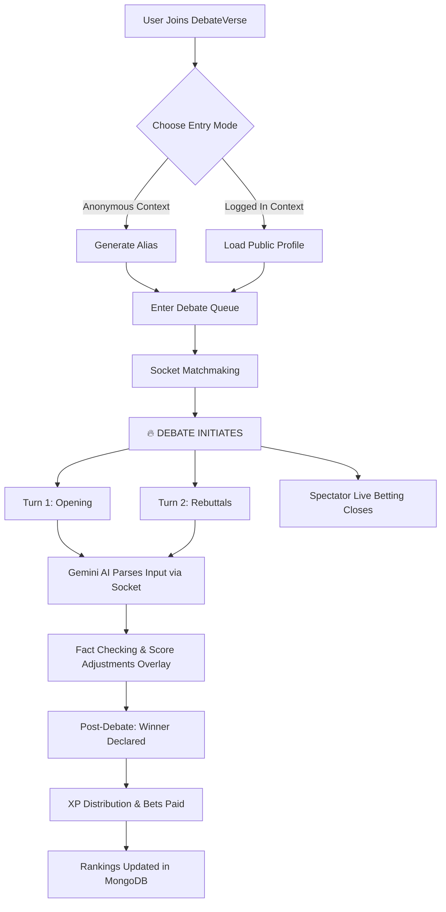

# DebateVerse: AI-Powered Anonymous Debate Arena

> [!NOTE]
> This document serves as the master blueprint and reference guide for the **DebateVerse** project. It outlines the core features, the technical stack, the architecture flow, and the ambitious scope of the entire platform.

## 🎯 Core Concept
DebateVerse is a real-time social platform where users can engage in structured debates on various topics—either anonymously or using their real identity. The Google Gemini AI acts as a moderator, fact-checker, and scoring judge. 

---

## 🛠️ Tech Stack & Architecture

### Frontend
*   **React.js**: Core UI framework for component-based architecture.
*   **Tailwind CSS**: Utility-first styling for a beautiful, responsive, modern dark-mode UI.
*   **Socket.io-client**: Real-time bidirectional event-based communication.
*   **Framer Motion**: Smooth, high-performance animations and transitions.
*   **React Router**: Client-side navigation.

### Backend
*   **Node.js + Express.js**: High-performance REST API backend.
*   **Socket.io**: Real-time WebSockets for matchmaking, chatting, and debating.
*   **JWT & Passport.js**: Secure authentication and Google/GitHub OAuth integrations.
*   **Bull**: Job queue processing for asynchronous AI tasks.

### Database & Integration
*   **MongoDB & Mongoose**: Primary NoSQL database and Object Data Modeling (ODM).
*   **Redis**: In-memory caching, user sessions, and Socket.io adapter.
*   **Google Gemini API**: Full AI integration for moderation, analytics, fact-checking, and topic generation.
*   **WebRTC**: P2P connections for live voice debating (optional).
*   **Cloudinary / AWS S3**: Cloud storage for avatars and file storage.

---

## 🚀 Final Feature List Breakdown (92 Total Features)

### 1. Debate Arena 🏟️ (10 Features)
*   **1v1 Classic**: Two users argumentatively clash over opposing sides.
*   **Team Debates**: 2v2 or 3v3 team-based battles.
*   **Battle Royale**: Multiple users with brutal elimination rounds.
*   **Topic Selection**: Randomized, AI-provided, or user-picked topics.
*   **Side Assignment**: Random PRO/CON automatic assignment logic.
*   **Timed Rounds**: Structured (Opening, Rebuttal, Counter, Closing).
*   **Turn-Based System**: Strictly alternating response logic and socket state management.
*   **Text Mode**: Classic typed arguments.
*   **Voice Mode**: Real-time voice arguments via WebRTC.
*   **Forfeit/Rematch**: Concede defeat or request an immediate runback.

### 2. Anonymous System 🎭 (7 Features)
*   **Anonymous Mode**: Engage completely devoid of persistent identity.
*   **Public Mode**: Use your real, verified DebateVerse profile.
*   **Random Alias Generator**: Gemini AI generates temporary, clever debate personas.
*   **Reveal Option**: Voluntary dramatic identity reveal post-debate.
*   **Masked Stats**: Prove your skill numbers without tying to public identity.
*   **Anonymous Leaderboard**: Separate rank hierarchies for masked profiles.
*   **Identity Protection**: Impervious walls between anonymous sessions and public hooks.

### 3. Anonymous Chat 💬 (7 Features)
*   **Spectator Chat**: Watch debates live in real-time rooms and cast comments.
*   **Anonymous Comments**: Speak without tracing back to profile.
*   **AI Moderation**: Real-time filtering of toxicity.
*   **Private Anonymous DMs**: Locked 1v1 post-debate discussions.
*   **Mutual Consent DMs**: Handshake system to allow private chatting.
*   **Auto-Delete Chats**: Strictly ephemeral; 24-hour expiration mechanism.
*   **Report System**: Self-policing community flagging.

### 4. AI-Powered Features (Gemini API) 🤖 (8 Features)
*   **AI Moderator**: Checks civility; flags inappropriate arguments dynamically.
*   **Real-time Fact Checker**: Scans arguments against trained knowledge and verifies live.
*   **Debate Scorer**: Evaluates logic, persuasion, and evidence.
*   **Topic Generator**: Harvests trending/controversial concepts into fresh debate ideas.
*   **Argument Assistant**: *Whisper Mode* helps users structure stronger sentences.
*   **Performance Analytics**: Deep-dive post-match breakdowns.
*   **Winner Declaration**: Autonomous algorithmic scoring and judging.
*   **Whisper Mode**: Private AI hints only visible to the user mid-debate.

### 5. Social & Community Features 👥 (13 Features)
*   **Global & Weekly Leaderboards**: All-time tops vs weekly resetting grinds.
*   **Category Rankings**: Subject-specific masters (Politics, Tech, Sports).
*   **Reputation System**: Tiers spanning from *Novice* to *Legend*.
*   **Follow System**: Track favorite public debaters or anonymous aliases.
*   **Live Notifications**: Alerts when a favorite user steps onto the stage.
*   **Debate Clips & Auto-Highlights**: AI pinpoints the best 'mic drops' for saving.
*   **Referral & Share URLs**: Simple sharable match links.
*   **Communities & Forums**: Threaded topics and localized group debate tournaments.

### 6. Spectator Mode 👀 (9 Features)
*   **Live Watching**: Full esports-like spectator capabilities.
*   **Live AI Overlay**: See the algorithmic scoring shift per message.
*   **Live Fact Verifications**: Visible flags when a debater is historically wrong.
*   **Live Chat**: Stadium-style chat rooms.
*   **Quick Reactions**: Spam emojis (🔥 👏 💯 🤔 😱).
*   **Replay System**: VOD replays of past legendary clashes.
*   **Advanced Replay**: Speed controls (0.5x - 2x) & key-moment jumps.

### 7. Spectator Betting & XP Economy 🎰 (8 Features)
*   **Place Bets**: Wager your earned XP on predicted winners.
*   **Dynamic Live Odds**: Odds shift heavily as debate progresses.
*   **Betting Window**: Time-limited wagers (Closes after Round 1).
*   **Pool Display**: Live visual of total XP bet pool.
*   **Payout System**: Database-driven transactional wins.
*   **Bet History & Accuracy Stats**: Track personal bet success rates.

### 8. Marketplace & Customization 🛒 (10 Features)
*   **XP Currency**: Universal earned currency (via debating/betting).
*   **Avatar & Frame Shops**: Buy cosmetics and flex statuses.
*   **Arena Themes**: Customize your side of the debate battlefield.
*   **Power-Ups**: Buy extra clock time, temporary hint accesses, or shields.
*   **Premium Aliases**: Reserved iconic masked names.
*   **Victory Effects**: Post-match graphical flexes (Fireworks, Confetti).
*   **Badges**: Public achievement flaunts.
*   **Daily Logins & Win Streaks**: Bonus multiplication algorithms.

### 9. Tournaments 🏆 (4 Features)
*   **Daily Quick Brackets**: 8-player fast-lane brackets.
*   **Weekly Major Championships**: Spotlighted main-event tournament.
*   **Entry Fees**: Spend XP to buy a tournament ticket.
*   **Prize Pools**: Massive XP/Badge allocations for victors.

### 10. User Profiles 👤 (10 Features)
*   **Auth**: Secure JWT/Bcrypt custom login + OAuth social (Google/Github).
*   **Public/Private Split**: Public stats vs deep personal analytics.
*   **Customization**: Bio, Avatars, Frames, and Trophy Cabinets.
*   **Historical Archive**: Paginated past matches tracking.

### 11. Safety & Moderation 🔐 (6 Features)
*   **AI Toxicity Filter**: Autonomous system protection against harmful words.
*   **Peer Reporting**: Flag mechanisms for community use.
*   **Mute/Block list**: Personal agency against harassment.
*   **Appeal System**: Admin-review system for contested bans.
*   **Tiered Penalties**: Strikes → Temporary Mute → Permaban.
*   **Age verification flow**: Soft-gates for mature rated topics.

---

## 🔄 User Workflow & Architecture



## 🗺️ Project Structure Reference
```
debateverse/
├── client/                 # React Frontend (Vite)
│   ├── src/
│   │   ├── components/
│   │   │   ├── DebateArena/
│   │   │   ├── AnonymousChat/
│   │   │   ├── Leaderboard/
│   │   │   └── AIAssistant/
│   │   ├── pages/
│   │   ├── context/
│   │   └── services/
│
├── server/                 # Node.js Backend
│   ├── controllers/
│   ├── models/             # User, Debate, Message, Bet, etc.
│   ├── routes/
│   ├── middleware/         # Auth, Error handlers
│   ├── services/
│   │   ├── geminiService.js    # AI implementation
│   │   └── socketService.js    # Real-time WebSockets
│   └── utils/
```
